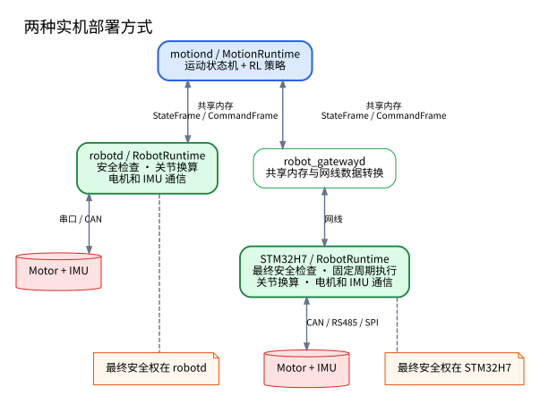
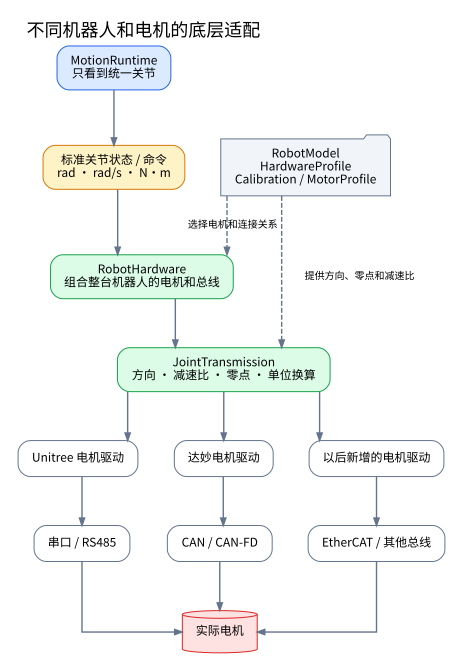

# STM32H7 四足机器人下位机嵌入式开发指导

- 状态：Draft v0.2
- 日期：2026-08-14
- 目标平台：STM32H743
- 适用对象：四足 12 自由度、轮足 16 自由度机器人下位机开发者
- 上位架构：[`quadruped_control_architecture.md`](quadruped_control_architecture.md)

## 1. 文档目的与适用范围

本文说明 STM32H7 下位机在四足/轮足机器人中的职责、模块边界、主数据流、安全规则和推荐开发顺序。

目标是让开发者先建立一套能安全验证的最小系统，再逐步增加电机、机器人和通信适配，而不是一开始冻结所有实现细节。

本文重点回答：

1. Linux 与 STM32H7 各自负责什么；
2. 下位机内部模块怎样分层；
3. 一个控制周期怎样处理状态和命令；
4. 怎样支持不同机器人、电机和控制板；
5. 上下位机必须交换哪些语义；
6. 断网、崩溃、重启或传感器异常时怎样保证安全；
7. STM32H7 的 DMA、Cache、内存和中断有哪些硬约束；
8. 应按什么顺序开发和测试。

### 1.1 当前目标

第一版以 STM32H743 为主，优先实现：

- CAN、RS485 等电机总线的稳定收发；
- IMU 原始数据采集和基础合法性检查；
- 统一关节状态与关节命令；
- 本地阻尼、失联看门狗、急停和最终限幅；
- `RobotRuntime` 固定周期运行；
- 通过点对点网线与 Linux 交换状态和命令；
- 对控制周期、数据年龄和故障进行可观测记录。

底层电机收发和安全检查以 **500 Hz～1 kHz** 作为测量目标。具体频率必须由总线带宽、CPU 占用和实测最坏执行时间决定，不假定所有任务都固定运行在 1 kHz。

### 1.2 当前边界

Linux 继续负责：

- 强化学习策略推理；
- 趴下、起立、站立、行走等运动状态机；
- 观测构建和高层命令选择；
- 导航、雷达、相机和任务规划；
- 日志、界面和大规模数据处理；
- 初期的复杂姿态估计。

STM32H7 负责：

- 电机和 IMU 的实时收发；
- 电机坐标与关节坐标换算；
- 最新命令接收、插值、限幅和合法性检查；
- 电机、IMU、网络和控制循环超时检查；
- 阻尼、失能、急停等本地安全动作；
- 生成统一 `StateFrame` 和实际命令帧（`EffectiveCommandFrame`）。

STM32H7 不负责导航、RL 推理、复杂 UI，也不应逐渐变成另一个 Linux 运动控制程序。

### 1.3 本文不冻结的内容

以下内容等正式开发相应模块时单独设计：

- 某一种电机的每个报文字节；
- CAN、RS485 的完整调度表；
- 上下位机线协议和重传策略；
- FreeRTOS 的最终任务数、优先级和栈大小；
- 每一项安全阈值的最终数值；
- 完整工程目录和类接口；
- 复杂姿态估计在 Linux 与 H7 之间的最终分工。

本文中的结构名表示稳定的职责边界，不要求立刻为每个名字建立一个类或一个 FreeRTOS 任务。

---

## 2. STM32H7 在系统中的位置

STM32H7 是最终硬件执行侧。Linux 可以提前检查命令，但只有 STM32H7 知道最终收到的命令、最新电机状态和总线状态，因此最终安全控制权必须在 STM32H7。

### 2.1 完整控制链路

使用 H7 时，上位机链路为：

```text
MotionRuntime in motiond
          │
          │ 本机共享内存：StateFrame / CommandFrame
          ▼
   robot_gatewayd
          │
          │ 点对点网线
          ▼
       STM32H7
          │
          │ CAN / RS485 / SPI
          ▼
      Motors + IMU
```

其中：

- `motiond` 运行 `MotionRuntime`，决定机器人怎样运动；
- `robot_gatewayd` 只做 Linux 本机数据与网线数据之间的转换、握手、版本检查和通信统计；
- STM32H7 运行 `RobotRuntime`，拥有最终命令检查和安全处置权；
- 电机自身超时保护和物理急停仍是独立的最后防线。

`robot_gatewayd` 不能代替 H7 的看门狗。即使 `motiond`、`robot_gatewayd` 或整个 Linux 崩溃，H7 也必须独立进入阻尼或失能。

### 2.2 与纯 Linux 路线的关系



项目同时保留纯 Linux 和 Linux + STM32H7 两条实机路线。两条路线的执行位置不同，但接口语义必须相同：

| 项目 | 纯 Linux | Linux + STM32H7 |
|---|---|---|
| 运动控制 | `motiond` | `motiond` |
| Linux 硬件进程 | `robotd` | `robot_gatewayd` |
| `RobotRuntime` | `robotd` | STM32H7 |
| 最终安全保护 | `robotd` | STM32H7 |
| 关节换算 | `robotd` | STM32H7 |
| 电机、IMU 通信 | `robotd` | STM32H7 |
| 对 MotionRuntime 的接口 | `StateFrame` / `CommandFrame` | 同一语义的帧 |

同一份 `StateFrame`、`CommandFrame`、控制模式、关节顺序、坐标系和单位定义必须同时适用于两条路线。

零点、方向、减速比和电机单位只能在最终硬件执行侧转换一次，不能由 Linux 和 STM32H7 各转换一次。

### 2.3 安全责任边界

Linux 负责尽早发现和避免不合理命令；STM32H7 必须再次独立验证。

STM32H7 可以：

- 拒绝一帧命令；
- 对目标进行限幅或插值；
- 用阻尼命令覆盖上位机命令；
- 失能电机；
- 锁存故障并拒绝重新进入主动控制。

上位机不能要求 H7 绕过本地安全规则。调试模式也不能自动取消这些规则。

---

## 3. 模块职责与主数据流

### 3.1 主要模块

下位机使用以下职责划分：

| 模块 | 主要职责 | 不负责 |
|---|---|---|
| `RobotRuntime` | 调度一个控制周期，汇总输入和输出 | 解析具体电机报文 |
| `RobotHardware` | 组合关节、电机、总线和 IMU，提供整机快照 | 运动策略 |
| `JointTransmission` | 关节量与电机量双向换算 | 总线收发 |
| `MotorDriver` | 某类电机报文、模式、错误和范围 | 机器人关节顺序 |
| `DeviceTransport` / `Bus` | 原始收发、DMA、总线调度和帧路由 | 关节物理含义 |
| `HostLink` | 上下位机帧收发、校验和链路统计 | 决定阻尼或失能 |
| `SafetySupervisor` | 汇总故障，决定允许、阻尼、失能或急停 | 解析网线字节流 |
| `CommandManager` | 保存最新合法候选命令、会话和序号 | 绕过安全监督器 |
| `StateManager` | 形成一致状态快照和 `StateFrame` | 阻塞等待所有总线 |

这些名字可以对应类、结构体或普通函数集合。不要因为有九个逻辑模块就创建九个任务。

### 3.2 主数据流

每个 `RobotRuntime` 周期必须按以下概念顺序执行：

1. 读取电机和 IMU 的最新完整状态快照，并计算各数据年龄；
2. 根据电机、IMU、总线、急停和循环状态更新安全状态；
3. 读取 `HostLink` 保存的最新上位机命令，检查启动编号、会话、序号和有效期；
4. 对候选关节命令完成插值、限幅、跳变检查和 NaN/Inf 检查；
5. 由 `SafetySupervisor` 决定正常执行、覆盖为阻尼，还是失能；
6. 通过 `JointTransmission` 换算，再由 `MotorDriver` 和总线发送给电机；
7. 生成 `StateFrame` 和最终实际执行的标准关节命令帧。

重要的是先更新安全事实，再选择最终命令。不能先把上位机命令写给电机，随后才发现命令已超时。

### 3.3 状态快照

电机总线和 IMU 可以异步更新状态：

```text
中断 / DMA
    ↓
总线任务解析
    ↓
固定大小状态缓冲区
    ↓
RobotRuntime 读取一致快照
```

`RobotRuntime` 不应等待一轮 CAN 或 RS485 全部完成。每个设备状态都要带本地更新时间和有效标志，由 `SafetySupervisor` 根据数据年龄判断是否可用。

更新共享快照可选择双缓冲、短临界区或带版本号的无撕裂读取。实现必须保证多字段状态一致，不长时间屏蔽中断，不等待低优先级任务，并统计缓冲区满或版本冲突。

### 3.4 命令路径和实际命令

上位机发送的是“请求执行的命令”，不是电机一定收到的命令。

候选命令可能因以下原因被改变：

- 通信周期与控制周期不同，需要插值；
- 位置、速度、力矩或 KP/KD 超过范围；
- 相邻目标跳变过大；
- 某个控制模式在当前电机上不可用；
- 安全状态要求阻尼或失能。

因此 H7 必须生成实际命令帧 `EffectiveCommandFrame`，记录最终发送侧采用的标准关节命令。该帧必须由 H7 回报，Linux 不能根据原命令自行猜测。

实际命令是放入 `StateFrame`，还是用独立只读报文发送，由后续上下位机通信专题决定。

---

## 4. 电机、关节和总线分层

### 4.1 固定依赖方向

硬件层使用统一关系：

```text
RobotHardware
      ↓
JointTransmission
      ↓
MotorDriver
      ↓
DeviceTransport / Bus
      ↓
BSP / HAL
```

上层只依赖下层抽象。BSP 不知道关节名称，`MotorDriver` 不知道运动状态机，`RobotHardware` 不解析 UART 字节。

不再把独立的 `MotorProtocol` 作为主要接口。某种电机的协议编码、解码、使能顺序和错误码转换属于该 `MotorDriver` 内部实现。

### 4.2 DeviceTransport / Bus

`DeviceTransport` 表示原始设备通信能力；具体 `Bus` 还可以包含共享介质的调度和设备路由。

它们负责 FDCAN、UART、SPI 等外设收发，DMA 完成通知与错误恢复，设备路由，固定缓冲区，以及占用率、超时、CRC 和溢出统计。RS485 的收发方向和轮询也属于总线层。

它们不解释关节物理量，不选择控制模式、急停动作或标准关节顺序。

同一条 RS485 总线只能有一个调度器。禁止让多个电机任务直接竞争同一个 UART；禁止在高优先级任务中忙等发送或接收完成。

### 4.3 MotorDriver

每种电机实现自己的 `MotorDriver`，负责命令编码、状态解码、使能/失能、故障清除、原生单位转换、能力声明、错误统一化和响应合法性检查，并提供最近更新时间与在线状态。

统一控制模式至少包括：

| 模式 | 含义 |
|---|---|
| `Disabled` | 不产生主动驱动力，具体表现由驱动定义 |
| `Damping` | 产生明确的速度阻尼，作为常用安全退路 |
| `JointImpedance` | 位置、速度、KP、KD 和前馈力矩组成的关节阻抗命令 |
| `Velocity` | 明确的速度控制模式 |
| `Torque` | 明确的力矩控制模式 |

`JointImpedance` 使用的控制量与常见 MIT 模式一致。MIT 仍只表示某些电机底层报文或
执行方式，不是系统对上层暴露的第六种通用控制语义。支持原生 MIT 的 MotorDriver
可以直接映射；其他驱动只能在明确支持等价控制律时转换，否则必须拒绝该模式。
轮子仍可以使用明确的 `JointImpedance`，此时通常设 `KP=0`，只给目标速度和 KD。

不能通过“KP 设为零”暗示 Torque，也不能通过“位置保持不变”暗示 Damping。每个模式必须显式表达并单独检查。

每个 `MotorDriver` 必须报告支持的统一模式，位置、速度、力矩和 KP/KD 范围，能够回报的状态，以及通信超时和失能后的真实行为。

如果电机不支持 `Damping`，必须在配置中指定经过验证的安全退路，例如 `Disabled`。不得在运行时临时猜测替代命令。

### 4.4 JointTransmission

`JointTransmission` 是电机语义和标准关节语义之间的唯一转换点。

它同时处理电机 ID 映射、正负方向、减速比、机械零点、标定偏置，以及位置、速度、力矩、KP 和 KD 的双向换算，并检查关节侧软限位和换算后的电机范围。

位置、速度、力矩和增益的换算必须使用同一套方向和减速比约定，并通过数值测试验证。不能只验证位置正确，就假定力矩和增益也正确。

所有上层统一使用：

- 位置：rad；
- 速度：rad/s；
- 力矩：N·m；
- 增益：与标准关节方程一致的 SI 语义。

复杂连杆、差动或轮腿耦合也属于这一层，但第一版只实现实际机器人需要的形式。

### 4.5 RobotHardware

`RobotHardware` 根据配置组合固定数量的关节、传动、电机驱动、总线、IMU 和板级急停输入。

它提供整机状态快照和整机命令提交入口，不拥有 MotionRuntime 的趴下、站立或行走状态。

---

## 5. 配置不同机器人和电机



### 5.1 配置分类

不要用一个巨大 `RobotConfig` 混合所有信息。至少区分：

| 配置 | 内容 | 典型变化原因 |
|---|---|---|
| `RobotModel` | 关节名称、顺序、功能角色和机械限制 | 更换机器人型号 |
| `HardwareProfile` | 电机类型、设备 ID、总线和传动关系 | 更换硬件方案 |
| `Calibration` | 某一台机器的零点、IMU 和传感器标定 | 维修或重新标定 |
| `MotorProfile` | 电机单位、模式能力、参数范围和安全退路 | 增加或更新电机 |
| `BoardConfig` | H7 外设实例、引脚、DMA、内存区和时钟 | 更换控制板 |

Linux 侧还可能有 `ControllerConfig`、`PolicyManifest` 和 `DeploymentConfig`，但它们不是 H7 板级配置的替代品。

### 5.2 标准机器人语义

标准关节顺序为：

```text
FL: hip, thigh, calf, optional wheel
FR: hip, thigh, calf, optional wheel
RL: hip, thigh, calf, optional wheel
RR: hip, thigh, calf, optional wheel
```

标准机体坐标为：

- `+X` 向前；
- `+Y` 向左；
- `+Z` 向上；
- 四元数顺序为 `w, x, y, z`。

机器人型号和关节顺序必须有明确标识，不能只根据数组长度推断 black、blackW 或其他机器人。

### 5.3 配置标识与启动检查

配置应具有机器可比较的稳定标识或哈希。取得主动控制权前，Linux 与 H7 至少核对：

- 数据格式版本；
- 机器人型号；
- 关节数量、名称和顺序标识；
- `HardwareProfile` 标识；
- `Calibration` 版本；
- 电机能力是否覆盖请求的控制模式；
- H7 固件和上位机是否在兼容范围内。

型号、关节顺序、标定或硬件配置不一致时，只允许诊断，以及配置中明确安全的阻尼或失能；不允许主动整机运动。

### 5.4 新增电机

新增电机时，先记录厂商协议、物理单位、范围和自身超时行为，再实现对应 `MotorDriver`；只有总线类型尚不存在时才新增 `DeviceTransport` / `Bus`。完成编码、解码和损坏帧测试后，在无负载台架验证使能、失能和安全退路，测量单/多电机总线，最后把能力与连接关系写入配置。

正常情况下不修改 `MotionRuntime`、统一帧语义和 `SafetySupervisor` 的总体状态机。

### 5.5 新增机器人

新增机器人时，依次建立 `RobotModel`、`HardwareProfile` 和每台实机独立的 `Calibration`，检查电机能力和安全退路。在阻尼状态通过实机—仿真姿态镜像检查映射，分别验证位置、速度、力矩、KP 和 KD 换算；通过吊架测试后才允许主动整机运动。

禁止复制一个旧机器人配置后只修改部分电机 ID 就直接上电运动。

---

## 6. RobotRuntime 与 FreeRTOS 基本原则

### 6.1 周期和任务不是同一概念

`RobotRuntime` 表示一次确定的整机执行流程，不要求它与每条总线使用同一个任务或同一个频率。

第一版可按下表划分测量目标：

| 工作 | 初始测量目标 | 说明 |
|---|---:|---|
| 电机收发和底层安全检查 | 500 Hz～1 kHz | 受总线能力限制 |
| IMU 采集 | 设备支持范围内 500 Hz～1 kHz | 可异步更新 |
| 上下位机高频状态与命令 | 先测 500 Hz～1 kHz | 不等于策略频率 |
| `RobotRuntime` | 根据带宽和最坏耗时确定 | 读取最新快照 |
| 监控和调试 | 5～10 Hz | 不得阻塞实时任务 |

最终频率必须在目标硬件、完整电机数量和最坏通信负载下测得。报告平均值不够，还要记录最大值和高分位抖动。

### 6.2 推荐任务边界

第一版可从少量任务开始：控制/安全任务运行 `RobotRuntime`；总线任务推进收发状态机；IMU 和 HostLink 任务处理各自 I/O；低优先级监控任务汇总统计并输出限速日志。

具体总线是否合并任务由驱动和带宽决定。`JointTransmission`、命令限幅、电机编解码、CRC、单个电机对象和单条安全规则通常只是函数，不应各自创建任务。

### 6.3 调度约束

高优先级任务必须有明确触发来源和可测的最坏执行时间，不等待日志、网络对端或低优先级任务，不无限期等待互斥锁，不动态申请内存或大量格式化字符串，并统计超期与连续超期。

RS485 等需要等待硬件完成的流程应由 DMA、中断和任务通知推进，不能使用忙等循环占用 CPU。

### 6.4 固定缓冲区

`RobotRuntime`、总线、IMU 和 HostLink 都使用固定容量缓冲区。运行阶段禁止 `new`、`delete`、`malloc`、`free`，也不要使用会隐式扩容的容器或字符串。

适合的形式包括固定数组、双缓冲、固定长度环形缓冲、预分配对象池和只保留最新值的单槽邮箱。

每个缓冲区必须定义满载行为：覆盖旧值、丢弃新值或触发故障。高频状态和命令通常只保留最新完整帧；不能让旧命令排队等待执行。

一次性控制权申请、故障复位和模式请求不能静默覆盖，必须使用请求编号和明确结果。

### 6.5 C/C++ 使用限制

建议使用 C 与受限 C++ 混合开发：

- CubeMX、启动文件、HAL、中断入口和底层 BSP 保持 C 接口；
- `RobotRuntime`、`MotorDriver`、`JointTransmission` 和配置检查可使用受限 C++；
- 避免异常、RTTI、深层继承、运行时对象创建和复杂模板元编程；
- 不在 CubeMX 自动生成文件中堆积机器人业务逻辑；
- 跨 C/C++ 边界使用窄的 `extern "C"` 函数和普通数据。

`virtual` 只用于确实需要运行时替换的稳定接口边界，例如少量 `MotorDriver` 或 `DeviceTransport` 实现。优先使用静态组合和配置；禁止为了“面向对象”建立深层设备继承树。

是否使用虚函数应通过可维护性和实测成本决定。少量虚调用通常不是 H743 的主要瓶颈，阻塞、总线调度、Cache 错误和中断占用更值得先处理。

---

## 7. 上下位机通信要求

### 7.1 通信职责

H7 侧 `HostLink` 只负责：

- 字节流或数据报收发；
- 帧同步、长度、版本和校验；
- 解码为固定的通信数据对象；
- 保存最新完整命令；
- 报告链路状态、接收时间、数据年龄和统计；
- 发送状态、实际命令和握手结果。

`HostLink` 不决定进入 `Damping` 还是 `Disabled`。它把合法帧年龄、CRC 错误和握手状态等事实交给 `SafetySupervisor`，由后者决定安全动作。

### 7.2 共同帧语义

纯 Linux 与 H7 路线使用相同的高层帧语义。

`CommandFrame` 至少包含：

- 数据格式版本；
- 上位机启动编号；
- 当前控制会话编号；
- 连续递增的命令序号；
- 生成时间和最大允许年龄或有效期；
- 机器人型号、关节顺序和标定版本标识；
- 每个关节的明确控制模式；
- 目标位置、目标速度、KP、KD 和前馈力矩；
- 命令来源和运动状态标识。

`StateFrame` 至少包含：

- H7 启动编号和当前会话编号；
- 状态序号与 H7 本地生成时间；
- 每个关节的位置、速度、估算力矩和数据年龄；
- 每个电机的在线状态、温度、错误和更新时间；
- IMU 姿态或原始量、有效状态和数据年龄；
- 总线、网络、缓冲区和控制循环统计；
- 当前安全状态和锁存故障；
- 最近接受的命令序号；
- 当前实际执行命令的序号；
- 机器人型号、配置和标定标识。

“收到”与“接受执行”必须区分。校验正确但会话错误、序号倒退或已过期的帧不能更新最近接受序号。

### 7.3 启动编号、会话和序号

每次 `motiond`、`robot_gatewayd` 或 H7 重启，都要产生新的启动编号或可识别标记。

主动控制前必须依次建立链路，核对数据版本和机器人配置，申请控制权，由 H7 分配或确认新会话，再从被动安全状态开始。

H7 只接受当前启动关系和当前会话中的命令。序号必须按定义递增，并使用回绕安全的比较方法。

同一时刻只允许一个控制会话拥有主动控制权。重复的一次性请求必须返回原结果，不能重复执行动作。

任何一侧重启后，禁止自动恢复之前的站立、行走或力矩输出。

### 7.4 时间和有效期

Linux 与 H7 使用不同的本地单调时钟。两边时间戳可用于分析延迟，但不能假定数值相同或始终精确同步。

H7 判断命令超时必须以 **H7 本地合法接收时间** 为主要依据：

```text
command_age = h7_now - h7_last_valid_receive_time
```

上位机填写的生成时间和有效期仍需检查，可用于拒绝明显旧帧；网络对时不能成为唯一安全依据。

高频命令只保留最新合法帧。旧命令、乱序命令和旧会话命令不能排队后补执行。

### 7.5 线协议约束

禁止把 C 或 C++ 结构体内存直接复制到网线上。Linux 与 H7 可能具有不同的：

- 编译器和 ABI；
- 结构体对齐和填充；
- 字节序；
- 浮点和枚举布局；
- 固件与软件版本。

线协议必须单独定义固定宽度数值、字节序、消息类型、版本、长度、序号、配置标识和完整性校验，同时定义损坏、未知版本、超长帧的丢弃规则以及固定缓冲区上限。

第一版通过点对点网线，高频通信优先评估 UDP；握手、配置和控制权等不能静默丢失的操作需要明确请求—应答或其他可靠机制。具体协议必须经过丢包、乱序、重复和重启测试后再冻结。

### 7.6 网关边界

`robot_gatewayd` 应保持很薄：连接 `motiond` 的共享内存，编解码网线报文，完成握手与兼容性检查，记录链路统计，并把 H7 返回的实际命令原样提供给日志系统。

它不运行 RL 策略、不进行关节换算、不生成替代阻尼命令，也不在 H7 拒绝命令后伪造“已执行”状态。

---

## 8. 安全状态与故障处理

### 8.1 状态模型

第一版至少区分：

```text
Boot → SelfCheck → Damping → ControlEnabled
                          ↘ SoftStop → Damping

任一运行状态 → LatchedDamping / Disabled / EmergencyStop
```

- `Boot`：刚启动，禁止主动输出；
- `SelfCheck`：检查配置、急停、电机、IMU、总线和上位机兼容性；
- `Damping`：执行配置验证过的阻尼退路；
- `ControlEnabled`：允许执行当前会话的合法主动命令；
- `SoftStop`：在允许的条件下平滑降低主动命令，再进入阻尼；
- `LatchedDamping`：故障锁存的阻尼状态；
- `Disabled`：失能电机；
- `EmergencyStop`：物理或严重软件急停状态。

因严重故障进入锁存状态后，信号恢复不能自动解除。复位必须经过明确请求、故障条件确认和重新自检。

### 8.2 SafetySupervisor 输入

`SafetySupervisor` 至少读取：

- 本地急停和使能输入；
- 每个电机在线状态、数据年龄、温度和故障；
- IMU 合法性和数据年龄；
- 总线错误、拥塞和缓冲区溢出；
- HostLink 链路状态和命令年龄；
- 启动编号、控制会话和命令序号检查结果；
- 机器人型号、硬件和标定版本检查结果；
- 关节位置、速度、力矩和增益范围；
- 命令跳变和 NaN/Inf 检查；
- 控制周期超期和连续超期次数；
- 当前状态和故障锁存记录。

### 8.3 最低故障处置

具体阈值由安全专题和实测确定，但行为必须预先定义：

| 情况 | H7 最低要求 |
|---|---|
| 网线断开 | 在本地看门狗期限内进入阻尼或失能 |
| Linux、`motiond` 或网关崩溃 | 不依赖对端通知，按命令年龄处置 |
| 命令过期 | 拒绝执行，不沿用最后主动命令 |
| 旧会话或序号倒退 | 丢弃并计数，不刷新看门狗 |
| H7 或上位机重启 | 建立新会话，从被动状态重新开始 |
| 型号、关节顺序或标定不一致 | 禁止主动控制 |
| 命令含 NaN/Inf | 整帧拒绝，按严重度进入安全状态 |
| 位置、速度、力矩、KP/KD 越界 | 限幅或拒绝；策略必须固定且可记录 |
| 目标突跳 | 插值、限斜率或拒绝，不能直接下发 |
| 电机状态超时或掉线 | 根据关节重要性进入锁存阻尼或失能 |
| 电机过温或驱动故障 | 按故障等级降级、阻尼或失能 |
| IMU 超时或明显非法 | 禁止依赖姿态的主动运动，进入安全状态 |
| 总线持续错误或缓冲区溢出 | 报告并在无法保证新鲜状态时安全停机 |
| 控制循环连续超期 | 触发降级或锁存安全状态 |
| 物理急停 | 立即采用经过硬件设计验证的急停路径 |

“继续执行上一帧”只能用于非常短、明确且验证过的容错窗口，不能成为无限期失联策略。

### 8.4 阻尼与失能退路

`Damping` 不是模糊名称。每种电机和机器人都必须验证底层模式与参数、等效阻尼范围、电机掉线行为、单关节失效后的整机策略、不同姿态风险和过渡时间。

某电机不支持可靠阻尼时，应配置 `Disabled` 或其他经过验证的退路。安全退路由 `MotorProfile` 和整机安全策略共同决定。

软件急停不能替代物理急停。物理急停的电气路径、驱动断能方式和恢复流程需要单独验证。

### 8.5 主动控制前置条件

进入 `ControlEnabled` 前至少要求：

- 自检通过且没有锁存故障；
- 急停释放并通过人工确认流程；
- 电机、IMU 和所需总线状态新鲜；
- 上下位机版本与配置一致；
- 当前控制会话有效且唯一；
- 命令模式得到所有相关电机支持；
- 初始目标与当前姿态差异在允许范围内；
- 本地阻尼、失联看门狗和急停已经在台架验证。

安全保护必须在主动整机运动之前完成，不能把它留到“机器人先跑起来以后再补”。

---

## 9. DMA、Cache、内存和中断注意事项

### 9.1 DMA 可访问内存

STM32H743 不同内存区的总线连接不同。DMA 缓冲区必须放在对应 DMA 主设备能够访问的内存区。

硬性规则：

- 禁止把外设 DMA 缓冲区放入 DTCM；
- 通过链接脚本和段属性明确 DMA 缓冲区位置；
- 对每个外设核对其 DMA 控制器可访问的 SRAM 区域；
- 不要仅凭变量地址“看起来像 SRAM”就认为可访问；
- 启动时可检查关键缓冲区地址范围并报告配置错误。

DTCM 适合 CPU 高频访问的栈或工作数据，但不适合作为普通外设 DMA 缓冲区。

### 9.2 D-Cache 一致性

H7 开启 D-Cache 后，CPU 与 DMA 可能看到不同内容。必须为每个 DMA 方向定义所有权和 Cache 操作：

- DMA 发送前，CPU 写完缓冲区后执行必要的 Cache clean；
- DMA 接收完成后，CPU 读取前执行必要的 Cache invalidate；
- 在 DMA 使用缓冲区期间，CPU 不得并发修改；
- Cache 操作的地址和长度要按缓存行边界对齐；
- 缓冲区本身也应按缓存行对齐并避免与无关变量共享缓存行。

具体缓存行大小和 CMSIS 接口以目标芯片与工程配置为准，不能把未经对齐的任意指针直接交给 Cache 维护函数。

另一种方案是通过 MPU 将专用 DMA 区域配置为非缓存，但仍要明确内存属性、屏障和所有权。无论选择哪种方式，都必须做 DMA 回环和高负载一致性测试。

### 9.3 内存预算

开发早期要为任务栈、电机与 HostLink 缓冲、状态/命令双缓冲、日志、配置、故障快照、中断栈和 RTOS 对象建立静态预算。

运行中监控任务栈高水位、缓冲区峰值和溢出次数。不能依赖偶尔重启来掩盖内存损坏。

### 9.4 中断原则

中断只读取或确认硬件状态，搬运固定大小描述符或索引，记录精简时间戳和错误位，通知任务并尽快返回。

禁止在 HAL 回调中完成整帧业务解析、关节换算、姿态估计、机器人控制或格式化日志。

中断与任务共享数据时必须明确缓冲区所有权、转移时机、内存屏障、临界区上限，以及溢出或通知丢失后的恢复方式。

### 9.5 时间戳和回绕

控制、安全和数据年龄统一使用单调计时源。优先使用 64 位微秒计时；如果底层硬件计数器较窄，则在统一时间服务中可靠扩展为 64 位。

若某处必须使用 32 位计数器，所有差值和序号比较都要采用经过测试的回绕安全算法，并保证阈值小于可无歧义比较的半周期。

禁止直接用 `now > deadline` 处理可能回绕的无符号计数；禁止把 Linux 墙上时间当作 H7 安全超时基准。

---

## 10. 调试信息与测试要求

### 10.1 最低调试信息

H7 至少提供以下低频、只读信息：

- 固件版本、启动编号和复位原因；
- 机器人型号、硬件、标定和板级配置标识；
- 当前安全状态、锁存故障和最近状态转换原因；
- `RobotRuntime` 周期、执行时间、最大值和高分位统计；
- 控制循环连续超期和累计超期次数；
- 各总线 RX/TX 速率、周期、错误和占用率；
- 各电机最新数据年龄、超时和错误次数；
- IMU 数据年龄、非法数据和丢样次数；
- HostLink 收发率、CRC、丢包、重复、乱序和命令年龄；
- 各固定缓冲区溢出次数；
- 各任务栈高水位；
- 最近接受命令和实际执行命令序号。

高优先级任务只写固定大小事件或计数器。低优先级监控任务限速输出，禁止在控制或中断路径大量 `printf`。

发生锁存故障时应保留一个小型故障快照，包括状态、时间、最近命令序号和关键数据年龄，便于断电前导出或重启后分析。

### 10.2 单元测试

脱离整机即可完成的测试至少包括：

- 每种电机命令编码和状态解码；
- CRC、长度、边界值和损坏帧处理；
- 位置、速度、力矩、KP、KD 的双向传动换算；
- 序号回绕、重复、乱序和旧会话判断；
- 32 位计时回绕安全计算（如果仍使用）；
- 命令插值、限幅、限斜率和 NaN/Inf；
- 安全状态转换和故障锁存；
- 配置标识与能力匹配；
- 固定缓冲区满载行为；
- 线协议的大小端和固定测试向量。

Linux 和 H7 应共享一批固定通信测试向量，避免两端各自测试通过但互不兼容。

### 10.3 台架测试

单电机和多电机台架依次验证：

- 上电默认失能；
- 使能与失能流程；
- 传感反馈单位和方向；
- 五种统一控制模式中实际支持的模式；
- 阻尼或失能安全退路；
- 通信中断和恢复；
- 超温、驱动错误和错误清除；
- 总线满负载周期与最坏响应时间；
- DMA、Cache 在持续高负载下的数据一致性；
- 急停在不同运行状态下的结果。

测试时先去除负载或采用限能装置，再上单关节台架、整腿台架和吊架。

### 10.4 上下位机故障测试

必须主动注入：

- UDP 丢包、重复、乱序、损坏和突发延迟；
- 网线拔出与重新连接；
- `motiond` 崩溃；
- `robot_gatewayd` 崩溃；
- Linux 整机重启；
- H7 看门狗复位和掉电重启；
- 旧进程继续发送旧会话命令；
- 配置、机器人型号和标定版本不一致；
- 过期命令与序号回绕边界。

每种测试都要验证最终电机行为、H7 状态转换、故障是否锁存、实际命令是否回报，以及恢复时是否要求建立新会话。

### 10.5 整机与压力测试

主动整机运动前，在吊架完成：

- 关节名称、ID、顺序、方向和零点核对；
- 实机姿态与仿真姿态镜像对比；
- 小增益、小力矩和低速度命令；
- 单个电机和 IMU 超时；
- 单条总线故障；
- 上位机失联和物理急停；
- 阻尼到失能的安全退路。

压力测试应同时打开完整电机通信、IMU、HostLink 和限速调试输出，持续记录：

- 周期抖动和最大执行时间；
- 丢帧、超时和缓冲区溢出；
- CPU 占用和栈余量；
- DMA/Cache 一致性错误；
- 温度、电源和长时间运行稳定性。

平均周期达标不能代替最坏情况测试。所有安全阈值都要有测试依据和版本记录。

### 10.6 验收清单

第一版 H7 路线至少满足：

- [ ] `motiond → robot_gatewayd → STM32H7` 链路稳定工作；
- [ ] 纯 Linux 与 H7 路线使用相同帧和关节语义；
- [ ] H7 能回报最终实际执行命令；
- [ ] 上位机命令不能绕过 H7 最终安全检查；
- [ ] 断网或 Linux 崩溃后，H7 独立进入已验证的安全状态；
- [ ] 重启、旧会话、乱序和过期命令不会恢复主动运动；
- [ ] 型号、关节顺序、硬件或标定不一致时禁止主动控制；
- [ ] 电机和 IMU 超时会触发预定处置；
- [ ] DMA 缓冲区不在 DTCM，Cache 一致性测试通过；
- [ ] 控制路径运行阶段无动态内存申请；
- [ ] 实测频率、最坏执行时间和安全余量有记录；
- [ ] 安全保护在主动整机运动之前完成验证。

---

## 11. 推荐开发顺序

开发顺序以“每一步都能安全验证”为原则。

### 阶段 1：板级驱动和单电机通信

完成：

- 系统时钟、单调计时和独立看门狗；
- GPIO、FDCAN、UART、RS485 方向、SPI 和 DMA；
- DMA 内存段、Cache 一致性和缓冲区测试；
- 一种电机的 `MotorDriver`；
- 单电机收发、状态解析、使能和失能；
- 周期、错误、超时和总线负载测量。

退出条件：电机无负载或限能台架连续运行稳定，所有范围和超时行为已知。

### 阶段 2：本地阻尼、失联看门狗和急停

在接入主动上位机控制前完成：

- `SafetySupervisor` 最小状态机；
- 本地命令超时看门狗；
- 电机状态超时；
- 物理急停输入；
- `Damping` 和 `Disabled` 退路；
- 故障锁存和明确复位；
- 断开测试源后的独立安全处置。

退出条件：不依赖 Linux，单电机和台架能在所有已定义故障下进入预期安全状态。

### 阶段 3：关节换算和配置

完成：

- `RobotModel`、`HardwareProfile`、`Calibration`、`MotorProfile` 和 `BoardConfig`；
- 标准关节顺序和单位；
- `JointTransmission` 的位置、速度、力矩和 KP/KD 换算；
- 配置标识和启动一致性检查；
- 实机姿态镜像与数值测试。

退出条件：手动活动实机关节时，仿真姿态、方向、零点和各物理量一致。

### 阶段 4：RobotRuntime 与多电机

完成：

- `RobotHardware` 整机组合；
- 多总线异步状态快照；
- `RobotRuntime` 主数据流；
- 命令插值、限幅、限斜率和实际命令；
- 多电机总线调度；
- IMU 采集、合法性和超时；
- FreeRTOS 调度和固定内存预算。

退出条件：完整电机数量下达到测量目标，最坏执行时间、状态新鲜度和安全余量可接受。

### 阶段 5：上下位机通信

完成：

- 固定线协议和跨平台测试向量；
- `CommandFrame`、`StateFrame` 和实际命令回报；
- 启动编号、控制会话、序号和有效期；
- 机器人型号、硬件和标定版本检查；
- `robot_gatewayd` 连接；
- UDP 或最终选择方案的丢包、乱序和重启测试。

退出条件：拔网线、杀死 Linux 进程、两端分别重启和注入旧帧时，H7 行为均符合安全要求。

### 阶段 6：整机、压力和故障测试

按以下顺序提高风险：

1. 无负载单电机；
2. 单关节台架；
3. 整腿台架；
4. 整机吊架；
5. 低增益、限力矩主动控制；
6. 地面站立和低速运动；
7. 完整运动与长时间压力测试。

每一步都要重复通信失联、电机/IMU 超时、急停和重启测试。上一阶段的安全验收未通过，不进入下一阶段。

---

## 12. 后续单独设计的内容

本指导只建立共同边界。实际开发时还需要分别补写：

1. **电机与总线设计**：具体电机报文、CAN ID、RS485 状态机、调度预算和电机自身安全行为；
2. **上下位机通信设计**：UDP/可靠通道选择、二进制格式、握手、兼容策略、测试向量和实际命令承载方式；
3. **实时任务设计**：FreeRTOS 任务、优先级、触发源、栈、最坏执行时间和共享数据同步；
4. **安全设计**：故障等级、阈值、锁存与复位、阻尼参数、急停电气路径和验证用例；
5. **板级内存设计**：链接脚本、MPU、DMA 内存区、Cache 策略和内存预算；
6. **IMU 与状态估计设计**：轴向、标定、滤波、基础合法性以及 Linux/H7 最终分工。

这些专题文档应在对应模块开始实现前编写，并以实测结果更新。本阶段不在主指导中提前展开完整协议、任务表和类目录。

本项目当前的核心约束可以归纳为：

> 上层只处理统一关节语义；H7 只执行当前会话中最新且合法的命令；最终安全检查始终位于最靠近电机的执行侧。
