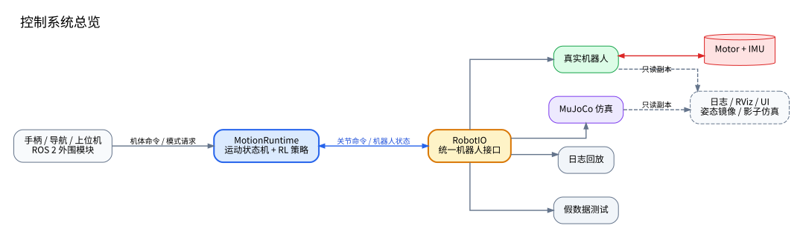
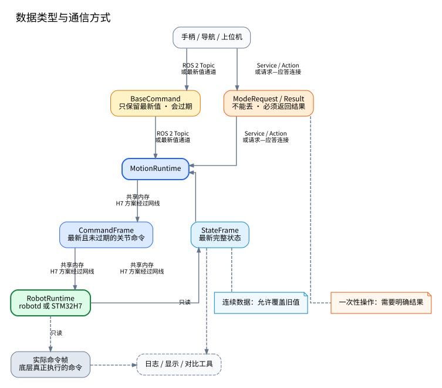
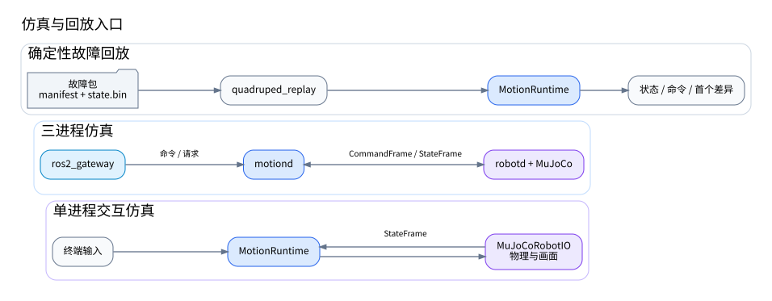

# 四足/轮足机器人本体控制架构设计

- 状态：Draft v0.5
- 日期：2026-08-14
- 适用范围：四足 12 自由度、轮足 16 自由度机器人
- 运行平台：Linux 工控机；以后可增加 STM32H7 下位机

相关文档：

- [`README.md`](README.md)：文档索引、状态和参考项目边界；
- [`第一阶段仿真闭环开发说明.md`](第一阶段仿真闭环开发说明.md)；
- [`STM32H7 四足机器人下位机嵌入式开发指导.md`](STM32H7%20四足机器人下位机嵌入式开发指导.md)。

## 1. 这份文档解决的问题

这份文档只确定系统的大框架：有哪些模块、每个模块负责什么、模块之间传什么数据，以及安全控制权放在哪里。

主要目标是：

1. 运动控制代码不依赖 ROS 2；
2. ROS 2 继续用于雷达、导航、RViz、录包和调试工具；
3. 仿真和实机使用同一套运动控制代码；
4. 支持 black、blackW 和以后不同的四足机器人；
5. 支持不同厂商的电机和不同通信总线；
6. 同时尝试纯 Linux 和 Linux + STM32H7 两种实机方案；
7. 上层程序崩溃或通信中断后，底层仍能让机器人进入阻尼或失能状态；
8. 支持日志回放、故障测试、实机姿态镜像和仿真实机对比。

这份文档不详细讨论：

- 某一种电机的具体报文；
- 共享内存怎样加锁；
- STM32 的任务、DMA 和外设代码；
- 以太网每个字节的格式；
- 线程优先级和安全阈值的具体数值；
- 配置文件和日志文件的完整格式。

这些内容等真正开始开发相应模块时，再单独写设计说明。这样能避免所有细节都挤在一份文档里。

## 2. 基本思路

### 2.1 模块和进程不是一回事

一个模块表示一组功能，不代表它一定是一个单独进程。

例如 `RobotRuntime` 表示“读取硬件、执行命令、保证安全”这一组功能。它既可以运行在 Linux 的 `robotd` 中，也可以放到 STM32H7 中。

### 2.2 控制代码不绑定通信方式

MotionRuntime 只通过统一的 RobotIO 接口读取机器人状态和发送关节命令。它不应该知道下面使用的是：

- 普通函数调用；
- 共享内存；
- 以太网；
- MuJoCo；
- 串口、CAN 或某个电机 SDK。

以后更换通信方式时，不需要修改策略、状态机和观测构建代码。

### 2.3 高频数据只使用最新一帧

关节状态和关节命令只关心最新值。新数据可以覆盖旧数据，不能在队列里积压旧命令。

起立、趴下、切换策略、修改配置和故障复位等操作不能直接覆盖，必须有请求编号和处理结果。

### 2.4 上层只看到统一关节

运动控制层只处理统一的关节名称、顺序、坐标系和标准单位。

电机 ID、总线、正负方向、减速比、零点和电机原生单位都在底层处理。

### 2.5 安全保护放在最靠近电机的一侧

- 纯 Linux 方案：`robotd` 拥有最终安全控制权；
- STM32H7 方案：STM32H7 拥有最终安全控制权。

上层可以提前限幅，但最终执行侧必须再次检查命令，并能在上层失联后独立产生阻尼命令。

### 2.6 调试工具不能影响控制

日志、绘图、ROS 2、远程监控和影子仿真只能复制数据进行观察，不能让控制线程等待它们，也不能向实机反向发送关节命令。

## 3. 总体架构



这套架构的核心边界是 RobotIO。MotionRuntime 上面是手柄、导航和任务命令，下面可以是真实机器人、MuJoCo、日志回放或测试程序。

ROS 2 不进入实机高频关节控制链路，但可以长期保留在外围。这里不是要完全抛弃 ROS 2，而是避免让安全关键控制依赖它。

## 4. 主要模块

### 4.1 公共数据结构

全系统使用同一套数据含义，主要包括：

- `StateFrame`：机器人状态；
- `CommandFrame`：MotionRuntime 请求执行的关节命令；
- `EffectiveCommandFrame`：底层检查后真正执行的关节命令，后文简称“实际命令帧”；
- `BaseCommand`：机体速度命令；
- `ModeRequest` 和 `ModeResult`：起立、趴下、运行功能和切换策略等请求与结果；
- `MotionStatus` 和 `SafetyStatus`：运动状态和安全状态。

这些数据结构不能依赖 ROS、Torch、MuJoCo 或某个电机 SDK。

### 4.2 RobotIO

RobotIO 是 MotionRuntime 使用机器人的唯一接口，主要提供：

- 读取最新 StateFrame；
- 提交 CommandFrame；
- 查询连接状态和安全状态；
- 申请和释放实机控制权。

RobotIO 只规定功能和出错时的行为，不规定底层怎样传输。

### 4.3 MotionRuntime

MotionRuntime 负责决定机器人怎样运动，包括：

- 选择当前使用手柄、导航还是远程命令；
- 管理趴下、起立、站立和功能运行等总体阶段；
- 按名称运行 RL 行走、固定姿态行驶或事件链等功能；
- 构造 RL 策略输入；
- 运行策略并生成关节目标；
- 检查非法值、关节命令范围和相邻周期跳变。

MotionRuntime 不读取电机协议、不处理零点，也不拥有最终安全控制权。

### 4.4 实机适配器与 RobotRuntime

实机适配器把 RobotIO 连接到真实机器人。

RobotRuntime 负责：

- 读取电机和 IMU；
- 把电机数据转换成统一关节数据；
- 检查命令序号、时间和控制会话；
- 执行安全检查和必要的限幅；
- 生成实际命令帧并发送给电机；
- 在上层失联时进入阻尼或失能；
- 生成 StateFrame。

它可以由 Linux `robotd` 实现，也可以部署到 STM32H7。

### 4.5 硬件层

硬件层按下面的关系拆分：

```text
整机硬件管理 RobotHardware
          ↓
关节换算 JointTransmission
          ↓
电机驱动 MotorDriver
          ↓
通信接口 DeviceTransport
```

- `DeviceTransport`：负责串口、CAN、CAN-FD、EtherCAT 等原始收发；
- `MotorDriver`：负责某类电机的报文、控制模式、错误码和允许范围；
- `JointTransmission`：负责方向、减速比、零点及位置、速度、力矩换算；
- `RobotHardware`：组合所有电机、总线和 IMU，形成整机状态。

不同机器人最常见的差异就是电机、总线和传动参数。增加一种电机时，原则上只增加相应 MotorDriver 和配置，不修改 MotionRuntime。电机驱动的详细接口等正式开发实机部分时再设计。

### 4.6 IMU 和姿态估计

这一部分负责 IMU 读取、轴向和单位转换、数据有效性检查以及 VQF 等姿态估计算法。

复杂姿态估计可以先放在 Linux。无论估计运行在哪里，最终硬件执行侧都必须能独立发现 IMU 超时或明显非法数据。

### 4.7 安全监督器

安全监督器位于最终执行侧。它可以拒绝或覆盖任何上层命令，并切换到阻尼、失能或急停状态。

### 4.8 上下位机通信程序

使用 STM32H7 时，Linux 增加一个很薄的 `robot_gatewayd`：

```text
motiond ← 本机共享内存 → robot_gatewayd ← 网线 → STM32H7
```

它负责本机数据与网线数据之间的转换、连接、版本检查和通信统计。它不运行运动策略，也不代替 STM32H7 的安全保护。

## 5. 三种主要运行方式


### 5.1 单进程开发和仿真

```text
MotionRuntime
     │ 进程内 RobotIO
     ▼
MuJoCo / 测试程序 / Linux 硬件
```

用于快速仿真、单元测试和早期台架调试。即使在单进程中，也应保留序号、超时和安全检查，避免开发模式与正式实机行为不同。

### 5.2 纯 Linux 实机

`motiond` 崩溃后，`robotd` 继续运行并让机器人进入阻尼。

### 5.3 Linux + STM32H7 实机

STM32H7 负责固定周期执行、电机和 IMU 通信、关节换算、命令平滑以及最终安全保护。Linux 继续负责 RL、运动状态机、导航、复杂估计、日志和界面。

两种实机方案的区别如下：

| 功能 | 纯 Linux | Linux + STM32H7 |
|---|---|---|
| 运动控制 | motiond | motiond |
| 最终安全保护 | robotd | STM32H7 |
| 关节换算 | robotd | STM32H7 |
| 电机和 IMU 通信 | robotd | STM32H7 |
| ROS 2、日志、界面 | Linux | Linux |

零点、方向和减速比只能在最终硬件执行侧转换一次，不能让 Linux 和 STM32H7 各转换一次。

## 6. 数据接口和通信方式



### 6.1 统一单位和关节顺序

- 关节位置：rad；
- 关节速度：rad/s；
- 力矩：N·m；
- 机体线速度：m/s；
- 时间：单调时钟；
- 四元数顺序：`w, x, y, z`；
- 机体坐标：`+X` 向前、`+Y` 向左、`+Z` 向上。

标准关节顺序：

```text
FL: hip, thigh, calf, optional wheel
FR: hip, thigh, calf, optional wheel
RL: hip, thigh, calf, optional wheel
RR: hip, thigh, calf, optional wheel
```

策略和配置必须明确记录关节名称和顺序，不能只根据数组长度猜测机器人型号。

RobotModel 还要明确记录每个关节的功能角色（腿、轮子或其他），以及是否有位置限制。
URDF/MJCF 中的源关节类型只是加载器需要处理的格式细节，不直接作为控制语义。
例如训练模型可以把轮子写成大转角范围的 `revolute`，加载后仍要归一化为
`轮子 + 无位置限制`。

### 6.2 每帧共有的信息

StateFrame 和 CommandFrame 至少要有：

- 数据格式版本；
- 本次程序启动编号；
- 当前控制会话编号；
- 连续递增的帧序号；
- 生成时间；
- 命令过期时间或最大允许年龄。

Linux 和 STM32H7 使用不同的本地时钟。下位机必须根据本地收到命令的时间独立判断超时，不能把网络对时当成唯一安全依据。

### 6.3 StateFrame

StateFrame 是一整份机器人状态，包括：

- 每个关节的位置、速度、估算力矩、温度、错误码和是否在线；
- 每个关节状态多久没有更新；
- IMU 姿态、角速度、加速度和是否有效；
- 总线、网络、安全状态和程序状态；
- 最近接受的 CommandFrame 序号；
- 当前实际执行命令的序号；
- 循环超时和丢帧等简单统计。

### 6.4 CommandFrame

CommandFrame 是 MotionRuntime 请求执行的关节命令，包括：

- 帧序号、会话编号和有效时间；
- 每个关节明确的控制模式；
- 目标位置、目标速度、KP、KD 和前馈力矩；
- 当前总体运动阶段和命令来源。

CommandFrame 只记录 Passive、GetUp、Stand、Running 和 GetDown 这类稳定的总体阶段。
具体运行的功能由低频 MotionStatus 中的 `behavior_name` 表示，不会为每个 blackW 功能
增加一个公共枚举。

控制模式至少包括：Disabled、Damping、JointImpedance、Velocity 和 Torque。其中
JointImpedance 表示位置、速度、KP、KD 和前馈力矩组成的关节阻抗命令，兼容常见的
MIT 控制形式。不能用“把 KP 设成零”来暗示力矩控制。
轮子也可以明确使用 JointImpedance：设 `KP=0`，只给目标速度和 KD。这仍然是
JointImpedance，不根据增益自动改成 Velocity 或 Damping。

### 6.5 实际命令帧

MotionRuntime 发出的 CommandFrame 可能被底层安全检查、限幅或插值修改。因此底层还要提供一份实际命令帧，表示最终真正发给电机的标准关节命令。

它主要用于日志和仿真实机对比。STM32H7 方案中，这份数据必须由 STM32H7 回传，不能由 Linux 猜测。

### 6.6 BaseCommand

BaseCommand 表示机器人整体怎样移动，主要包含 `vx`、`vy`、`wz`、来源、优先级、生成时间和有效期。

每个来源只保留最新命令。来源停止更新后，速度命令自动归零。

### 6.7 ModeRequest 和 ModeResult

起立、趴下、运行功能、切换策略、申请控制权和故障复位属于一次性操作。每个请求要有唯一编号，并返回接受、拒绝、执行中、完成或失败。

`StartBehavior` 通过名称选择具体功能。当前只冻结 `rl_locomotion`：它只能从
`Stand` 进入 `Running`，启动请求必须同时带有未过期的有效 `BaseCommand`，输出为 RL 关节阻抗命令，内部阶段为 `starting` 和 `driving`。首次成功推理后请求变为
`Completed`，
随后行为持续运行；推理超时、观测/动作转换或命令提交失败时请求变为 `Failed`，清空 RL
输出并回到 `Passive`。运行期间 `BaseCommand` 过期或暂时缺失只产生零速度观测，不能继续使用旧速度命令。`EnterPassive` 可以打断该行为，`SwitchPolicy` 允许进入策略过渡。

其他行为名称仍然拒绝，待真实需求明确后再逐个定义其进入条件、输出模式、完成、超时和
失败规则，不提前建设通用行为插件系统。

`SwitchPolicy` 只负责切换 RL 功能使用的策略，不替代 `StartBehavior`。

当前实现使用固定容量策略目录。应用在启动期完成 YAML 配置读取、Torch 模型加载和预热，
随后通过 `attach_policy()` 选择初始策略，并用 `register_policy()` 注册其他已加载策略；
MotionRuntime 不在控制周期中访问模型文件或动态加载插件。策略对象由应用持有，
MotionRuntime 只保存其同步推理接口和对应的 `RlController`。

`SwitchPolicy` 仅在 `rl_locomotion` 处于 `Running` 时接受。目标名称不存在或尚未注册时
返回 `Rejected`。若当前关节姿态接近目标策略默认姿态，运行时立即切换到目标策略，
清空目标策略的观测历史、旧动作和推理节拍，并以目标策略完成下一次推理；若姿态差异较大，
先在固定控制周期内输出位置阻抗命令，平滑过渡到目标默认姿态。过渡期间旧策略和目标策略
都不执行推理，最新 `BaseCommand` 仍可输入，但只在切换完成、RL 恢复后参与观测。

策略切换的首次目标推理、过渡命令提交或状态校验失败时，请求返回 `Failed`，旧 RL 命令被
清空并进入 `Passive`。`EnterPassive` 可以在过渡期间立即打断切换，被打断的切换请求同样
取得明确的 `Failed` 终态。

重复收到同一个请求时，不能把同一个动作再执行一次。

MotionRuntime 对请求采用固定生命周期：新请求先返回 `Accepted`，进入实际控制周期后
变为 `Running`，成功完成返回 `Completed`，未满足前置条件或请求类型当前不可用时返回
`Rejected`，运行中发生 RobotIO、状态或推理错误时返回 `Failed`。活动请求重试返回当前
状态，已终态请求重试返回保存的历史终态；更小的旧 `request_id` 不得覆盖更新的请求。

`EnterPassive` 拥有最高打断优先级，可以中止任意主动动作并把被中止请求交付为 `Failed`。
`GetUp` 和 `GetDown` 互相打断时，旧动作同样交付 `Failed`，新动作从最新状态重新开始。
运行错误后 MotionRuntime 必须回到安全 `Passive`，并在 `MotionStatus.error_message` 中保留
最近一次错误；当前模式、行为名、行为阶段、策略名和 `policy_ready` 由运行时统一更新。

请求终态在产生周期即通过周期更新输出交付（输入请求经 `result` 字段，同周期被中断的
其他请求经固定容量的 `result_events` 数组）；运行时内部只保存有限历史供重试查询，
调用方不能依赖该历史缓存作为可靠结果通道。

### 6.8 推荐通信方式

| 数据 | 要求 | 推荐方式 |
|---|---|---|
| StateFrame | 只读最新完整状态 | 同进程直接调用；Linux 双进程用共享内存；H7 用网线 |
| CommandFrame | 只执行最新且未过期命令 | 同进程直接调用；Linux 双进程用共享内存；H7 用网线 |
| 实际命令帧 | 只供记录和观察 | 与状态一起回报，或使用独立只读通道 |
| BaseCommand | 每个来源只保留最新值 | ROS 2 Topic 或本机最新值通道 |
| ModeRequest/Result | 不能丢，需要明确结果 | ROS 2 Service/Action 或可靠的请求—应答连接 |
| 启动、配置、控制权 | 不能丢，需要明确结果 | Linux 本机 socket；H7 使用可靠通信 |
| 日志和界面数据 | 允许丢帧，不能拖慢控制 | 独立缓冲区或 ROS 2 |

当前建议是：

- `motiond` 与 `robotd/robot_gatewayd` 的高频通信优先用固定大小共享内存；
- Linux 本机低频请求使用 Unix Domain Socket；
- STM32H7 高频通信优先尝试点对点 UDP，具体方案通过测试确定；
- Fast DDS 可以以后用于跨电脑通信或一份数据发给多个程序，但不作为本机一对一控制的首选；
- 不计划自己再造一个通用的 ROS 2 替代框架。

### 6.9 上下位机不能直接传 C++ 内存

Linux 和 STM32H7 的结构体对齐、编译器和字节顺序可能不同，不能直接把 C++ 对象复制到网线上。

网线数据需要单独定义固定宽度、字节顺序、版本、长度和校验。具体格式在开发上下位机通信时再写专门文档。

## 7. 支持不同机器人和电机


建议把配置分开：

| 配置 | 内容 |
|---|---|
| RobotModel | 关节名称、顺序、功能角色和关节限制 |
| HardwareProfile | 电机类型、设备 ID、总线和传动参数 |
| Calibration | 某一台机器人独有的零点和传感器标定 |
| MotorProfile | 电机单位、控制模式和允许范围 |
| ControllerConfig | 控制周期、增益、输出和安全参数 |
| RlConfig | black 策略模型路径、缩放、默认姿态和增益 |
| DeploymentConfig | 使用纯 Linux 还是 STM32H7，以及通信方式 |
| BoardConfig | STM32 板级外设配置，仅供下位机使用 |

新增一种机器人时，优先通过 RobotModel、HardwareProfile 和 Calibration 完成适配。

新增一种电机时，原则上只需要：

1. 增加电机参数；
2. 实现相应 MotorDriver；
3. 如果总线不同，再增加 DeviceTransport；
4. 在 HardwareProfile 中填写连接关系。

电机驱动要说明它支持哪些控制模式、允许多大 KP/KD、速度和力矩，以及能返回哪些错误信息。上层运动控制代码中不应出现厂商名称和电机协议判断。

取得实机控制权前，双方必须在启动握手中核对数据格式、机器人名称和有序关节名称；最终执行侧还必须独立检查零点、电机和传感器标定配置。任一检查失败时，只允许诊断和阻尼，不允许主动运动。这些启动期信息不重复放入高频帧。

## 8. 仿真、回放和实机对比



### 8.1 MuJoCo 适配器

接收 CommandFrame，运行物理仿真并产生 StateFrame。MotionRuntime 不需要知道自己控制的是仿真还是真机。

### 8.2 日志回放

把以前记录的 StateFrame 按原速度或指定倍速重新送给 MotionRuntime，用于：

- 复现实机问题；
- 比较修改前后的控制输出；
- 测试 Observation、状态机和策略；
- 自动检查新代码是否改变了原有行为。

回放程序默认不能向实机写命令。

### 8.3 假数据测试

测试程序可以主动构造电机掉线、IMU 非法、状态超时、序号倒退等情况，用来检查安全保护，不需要等待实机真的发生故障。

### 8.4 实机姿态镜像

这个功能用于新机器人、关节映射和零点检查。

机器人保持 Damping，由人手动活动关节。程序把实机 StateFrame 中的关节位置和速度直接设置到 MuJoCo。

可以检查：

- 电机 ID 是否对应正确关节；
- 四条腿和关节顺序是否正确；
- 正负方向、减速比和零点是否正确；
- 仿真姿态和真实姿态是否一致。

这种方式检查的是关节映射和姿态，不是电机动力学。

### 8.5 并行影子仿真

需要比较动态响应时，把底层的实际命令帧同时送给电机和 MuJoCo，再对比两边产生的状态。

它可以比较关节响应、延迟、阻尼、摩擦和电机模型。但 MuJoCo 的输出永远不能反向控制实机。

姿态镜像、影子仿真、日志和 ROS 2 工具只获得只读数据，不申请实机控制权。

## 9. 控制权和安全

### 9.1 建立控制连接

RobotRuntime 启动后先进入 Disabled 或 Damping。MotionRuntime 控制实机前需要：

1. 检查双方数据格式版本；
2. 核对机器人名称和有序关节名称；
3. 由最终执行侧完成电机、零点和传感器标定自检；
4. 申请控制权并获得新的会话编号；
5. 从 Passive 状态重新开始。

RobotRuntime 只接受当前会话、序号递增且没有过期的命令。同一时刻只能有一个程序控制实机。

任一进程或 STM32H7 重启后，都必须生成新的启动编号和会话编号。禁止重启后自动恢复之前的站立或行走状态。

### 9.2 安全状态

```text
Boot → SelfCheck → Damping → ControlEnabled
                          ↘ SoftStop → Damping

任一运行状态 → LatchedDamping / Disabled / EmergencyStop
```

因故障进入锁存阻尼、失能或急停后，不能因为信号短暂恢复就自动解除，需要人工或明确流程复位。

### 9.3 最低安全检查

最终硬件执行侧至少检查：

- 命令超时、乱序、会话不匹配和 NaN/Inf；
- Linux 或网络失联；
- 电机状态超时、错误、温度和总线故障；
- IMU 超时和明显非法数据；
- 关节位置、速度、力矩和 KP/KD 越界；
- 目标突然跳变；
- 控制循环连续超时；
- 启动匹配或执行侧本地标定自检未通过；
- 命令关节数量不匹配。

STM32H7 方案中，即使 Linux 崩溃或网线断开，STM32H7 也必须独立进入阻尼或失能。实机还需要电机自身超时保护和物理急停。

## 10. 运行频率和调试信息

以下频率作为第一版参考，不是固定要求：

| 任务 | 参考频率 |
|---|---:|
| 电机收发和底层安全检查 | 500 Hz～1 kHz |
| 状态汇总和运动控制 | 约 200 Hz |
| RL 推理 | 约 50 Hz |
| 手柄 | 50～100 Hz |
| 导航 | 约 30 Hz |
| 调试信息 | 5～10 Hz |

关键循环中不要写磁盘、等待网络、拼接大量文本或加载模型。应使用单调时钟，提前分配内存，并记录：

- 实际周期和执行时间；
- 99% 的周期能达到的范围和最大值；
- 连续超时次数；
- 最新帧序号和数据年龄；
- 丢帧、乱序和重连次数；
- 当前安全状态和实际执行命令。

选择 ROS 2、共享内存或其他通信方式之前，应在同一台目标工控机上实际比较延迟、抖动和 CPU 占用。

## 11. 测试重点

单元测试至少包括：

- 电机报文和 CRC；
- 方向、减速比和零点换算；
- 命令来源选择和超时；
- 运动状态转换；
- 安全保护条件；
- 策略输入输出和关节顺序；
- 配置检查。

同一组 RobotIO 测试要用于：进程内、共享内存、STM32H7、MuJoCo、日志回放和假数据实现，确保它们对超时、乱序和旧会话的处理一致。

Linux 与 STM32H7 应共用一批固定测试报文，检查正确帧、损坏帧、版本错误、重复、乱序、丢包、重启和断线。

还要主动测试 motiond、robotd、gateway 崩溃，网线断开，电机或 IMU 掉线，以及 Torch、FAST-LIO 和日志同时运行时的控制周期。

## 12. 开发顺序

### 阶段 0：确定接口和测量现状

- 测量当前 ROS 2 路径的延迟、抖动和 CPU 占用；
- 确定坐标系、关节顺序和单位；
- 定义 StateFrame、CommandFrame、BaseCommand 和 ModeRequest；
- 整理当前 ROS 字段和硬件字段怎样转换到新接口。

### 阶段 1：提取公共控制代码

- 建立公共数据结构、RobotModel 和 RobotIO；
- 从 ROS 节点中提取 MotionRuntime；
- 把 black/blackW 的方向、减速比、零点和映射移到配置；
- 建立日志回放和假数据测试。

### 阶段 2：完成纯 Linux 实机

- 提取电机通信、电机驱动、关节换算和整机硬件管理；
- 建立安全监督器、控制会话和实际命令帧；
- 实现 `robotd` 与 `motiond` 的共享内存通信；
- 按单电机、台架、吊架、整机顺序验证。

### 阶段 3：完成仿真和调试工具

- 实现 MuJoCo 适配器、实机姿态镜像和影子仿真；
- 建立日志记录、回放和状态对比；
- 通过 ROS 2 接入现有导航、雷达、RViz 和调试工具。

### 阶段 4：开发 STM32H7 路线

- 定义并测试上下位机网线报文；
- 实现 `robot_gatewayd` 和 STM32H7 通信；
- 将最终安全、关节换算和硬件通信放到 STM32H7；
- 使用同一套 RobotIO 测试验证两条实机路线。

## 13. 当前已经确定的决定

1. 运动控制核心不依赖 ROS 2，但 ROS 2 继续用于外围模块和工具。
2. MotionRuntime 只通过 RobotIO 使用机器人。
3. StateFrame 和 CommandFrame 只保留最新值，不积压旧数据。
4. 起立、切换策略、配置和复位使用有结果的请求方式。
5. Linux 双进程的高频通信优先使用固定大小共享内存。
6. 同时支持纯 Linux 和 Linux + STM32H7。
7. 最终安全保护放在实际连接电机的一侧。
8. 不同机器人和电机通过配置、电机驱动和关节换算适配。
9. 上下位机使用明确的网线报文，不能直接传 C++ 对象内存。
10. 底层提供实际命令帧，供日志和影子仿真使用。
11. 实机姿态镜像用于检查关节映射和零点；影子仿真用于比较动态响应。
12. 仿真、日志和 ROS 2 工具只读，不允许控制实机。
13. Fast DDS 保留为以后可选方案，但不计划基于它重写一套通用框架。
14. 第一阶段先完成 black，再在 M5 通过配置和模型支持 blackW。
15. 本仓库文档和公共接口优先于 `../rl_sar` 与 `../real_robot`；参考项目只提供行为、
    参数和硬件事实。

## 14. 后续需要单独设计的内容

真正开始开发前，再分别补充以下说明：

1. 公共数据结构和 RobotIO 的完整字段；
2. Linux 共享内存和本机请求通信；
3. Linux 与 STM32H7 的网线报文；
4. 电机驱动、总线管理和新电机适配流程；
5. 安全状态、故障等级、阈值和复位流程；
6. MuJoCo、回放、姿态镜像和影子仿真；
7. Linux/STM32 任务调度和性能测试。

目前还没有决定：

- 共享内存具体使用哪种同步方法；
- STM32H7 高频和低频通信最终使用 UDP、TCP 还是组合方案；
- 完整姿态估计最终放在 Linux 还是 STM32H7；
- 各项安全阈值。

### 架构图源文件

文中的图片使用 SVG，可以放大查看。可编辑源文件位于 [`diagrams/`](diagrams/) 目录。修改 `.dot` 文件后，在本目录运行：

```bash
for src in diagrams/*.dot; do
  dot -Tsvg "$src" -o "${src%.dot}.svg"
done
```
